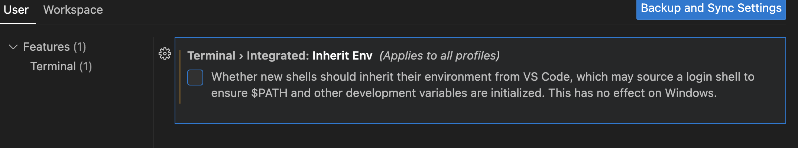

# Dotfiles

## Step by step implementation

## TODO
	1. MAC Configuration
 		- Terminal Preferences
		- Changed Shell to ZSH
		- Dock Preferences
		- Finder Show Path Bar
		- Trackpad (Three Finger Drag and Tap to Click)
		- .zshrc
		- Git (config and SSH)
	2. Create a Dotfile branch for Linux OS
		- Git (config and SSH)

## Script to include instalations to brewfile

`brew bundle dump --force --describe` -> alias `bbd`

## Pyenv instalation

If the system failed to create the pyenv folder use this:

`git clone https://github.com/pyenv/pyenv.git ~/.pyenv`

# To remove duplicated paths on terminal 

type CMD+, and uncheck inheritEnv setting

	
